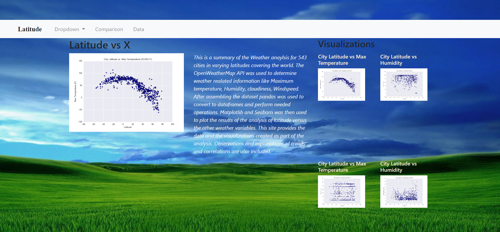
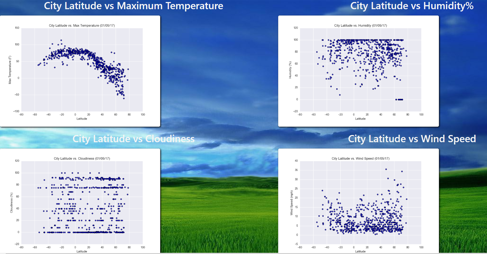
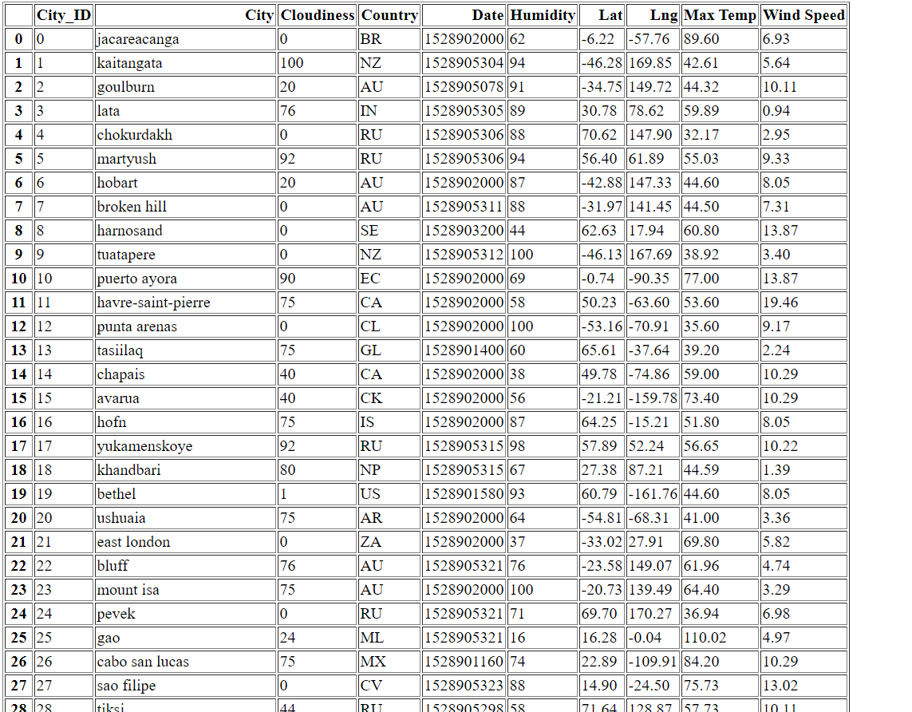
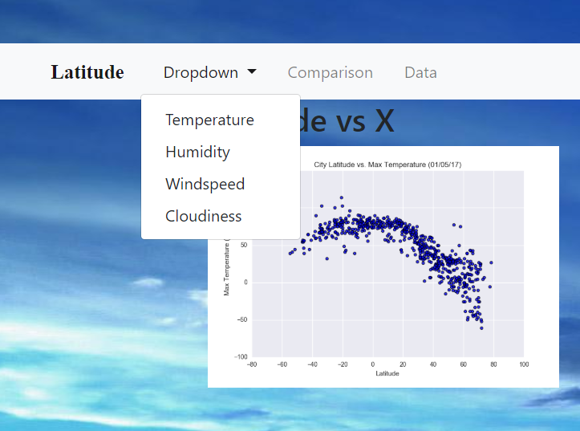

# Web Visualization Dashboard (Latitude)

## Latitude - Latitude Analysis Dashboard with Attitude
### HTML and CSS Web Design

In building this dashboard, we'll create individual pages for each plot and a means by which we can navigate between them. These pages will contain the visualizations and their corresponding explanations. We'll also have a landing page, a page where we can see a comparison of all of the plots, and another page where we can view the data used to build them.

Utilizing the "cities.csv" file provided, first the data is converted into a Dataframe, which is then writted to an HTML page so that the web dashboard can utilize the data as an individual landing page.

* The Main page displays one chart as an example for the images provided, and shows the four pages created for each scatter plot image provided.
* The Comparisons page contains all of the visualizations on the same page so we can easily visually compare them.
* Four visualizations pages are accessible through the Navigation bar near the top of the page, made possible by utilizing Bootstrap on the main page.

#### Landing page:



#### Comparisons page:

#### Data page:

#### Visualization pages:

#### Navigation menu:

