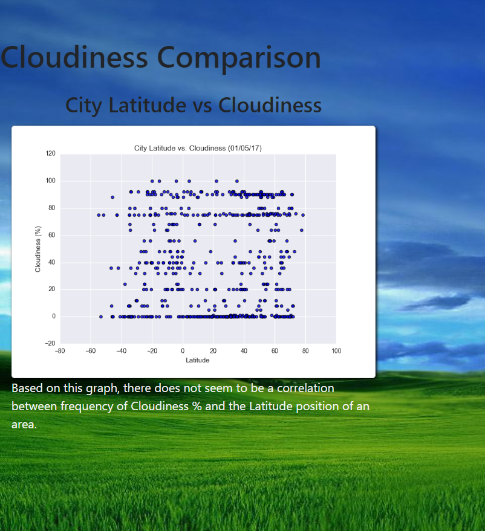

# Web Visualization Dashboard (Latitude)

## Latitude - Latitude Analysis Dashboard with Attitude
### HTML and CSS Web Design

In building this dashboard, individual pages will be created for each plot and a means by which we can navigate between them. These pages will contain the specific weather scatter plot visualizations and their corresponding explanations.

HTML is utilized to create each page and structure the images and text within them. Bootstrap is used in CSS styling to create the Navigation bar to visit different pages and to utilize font styles and font colors. 

* The Main page displays one chart as an example for the images provided, and shows the four pages created for each scatter plot image provided.
* The Comparisons page contains all of the visualizations on the same page so we can easily visually compare them.
* Four visualizations pages are accessible through the Navigation bar near the top of the page, made possible by utilizing Bootstrap on the main page.

## Resources

Data source: cities.csv

Software: HTML, CSS, Bootstrap 3

### Landing page:



#### Comparisons page:

#### Data page:

#### Visualization pages:

#### Navigation menu:

