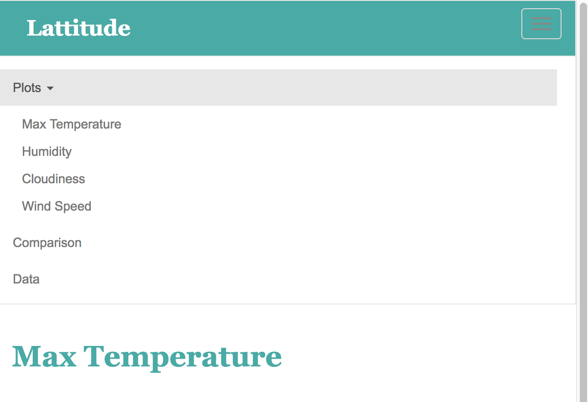

# Web Visualization Dashboard (Latitude)

## Background

Data is more powerful when we share it with others! Let's take what we've learned about HTML and CSS to create a dashboard showing off the analysis we've done.

## Latitude - Latitude Analysis Dashboard with Attitude

In building this dashboard, we'll create individual pages for each plot and a means by which we can navigate between them. These pages will contain the visualizations and their corresponding explanations. We'll also have a landing page, a page where we can see a comparison of all of the plots, and another page where we can view the data used to build them.

### Website Requirements

* A [landing page](#landing-page) containing:
  
* Four [visualization pages](#visualization-pages)
* A ["Comparisons" page](#comparisons-page) 
* A ["Data" page](#data-page)

The website must, at the top of every page, have a navigation menu that:

* Has the name of the site on the left of the nav which allows users to return to the landing page from any page.
* Contains a dropdown on the right of the navbar named "Plots" which provides links to each individual visualization page.
* Provides two more links on the right: "Comparisons" which links to the comparisons page, and "Data" which links to the data page.
* Is responsive (using media queries). The nav must have similar behavior as the screenshots ["Navigation Menu" section](#navigation-menu) (notice the background color change).

#### Landing page

Large screen:



#### Comparisons page

Large screen:

Small screen:

#### Data page

Large screen:

Small screen:

#### Visualization pages

You'll build four of these, one for each visualization. Here's an example of one:

Large screen:

Small screen:

#### Navigation menu

Large screen:

Small screen:

